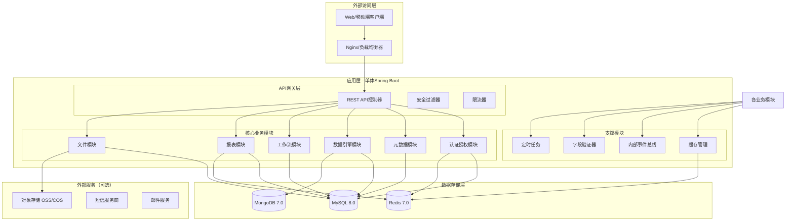

# 简道云项目架构设计文档

## 📋 项目概览

### 项目名称
简道云（企业级低代码/无代码平台）

### 核心功能
- 可视化表单设计器（拖拽式）
- 动态数据存储与管理
- 业务流程引擎（审批流）
- 数据报表与可视化
- 多租户SaaS支持

### 技术栈
| 组件 | 选型 | 版本 | 备注 |
|------|------|------|------|
| 后端框架 | Spring Boot | 3.2+ | Java 17+ |
| 构建工具 | Gradle | 8.0+ | Kotlin DSL |
| 数据库 | MySQL | 8.0+ | 主业务数据 |
| 文档数据库 | MongoDB | 7.0+ | 动态数据存储 |
| 缓存 | Redis | 7.0+ | 会话/热点数据 |
| 前端框架 | React/Vue | 可选 | 独立前端项目 |
| 容器化 | Docker | 20.10+ | 可选，后期扩展 |

---

## 🏗️ 系统架构设计

### 整体架构图



---

## 📁 项目结构设计

### 目录结构
```
jian-daoyun/
├── build.gradle.kts                    # 项目构建配置
├── settings.gradle.kts                 # 模块设置
├── gradle.properties                   # Gradle属性
├── gradle/                             # Gradle脚本目录
├── README.md                           # 项目说明
│
├── src/main/
│   ├── java/com/jiandaoyun/
│   │   ├── Application.java            # 主启动类
│   │   ├── config/                     # 配置类目录
│   │   │   ├── DatabaseConfig.java     # 数据库配置
│   │   │   ├── RedisConfig.java        # Redis配置
│   │   │   ├── MongoConfig.java        # MongoDB配置
│   │   │   ├── WebConfig.java          # Web MVC配置
│   │   │   ├── SecurityConfig.java     # 安全配置
│   │   │   ├── AsyncConfig.java        # 异步配置
│   │   │   └── SwaggerConfig.java      # API文档配置
│   │   │
│   │   ├── common/                     # 公共模块
│   │   │   ├── constant/               # 常量定义
│   │   │   │   ├── SystemConstant.java # 系统常量
│   │   │   │   ├── ErrorCode.java      # 错误码
│   │   │   │   └── FieldType.java      # 字段类型枚举
│   │   │   │
│   │   │   ├── enums/                  # 枚举定义
│   │   │   │   ├── UserStatus.java     # 用户状态
│   │   │   │   ├── FormStatus.java     # 表单状态
│   │   │   │   └── WorkflowStatus.java # 工作流状态
│   │   │   │
│   │   │   ├── exception/              # 异常处理
│   │   │   │   ├── BusinessException.java  # 业务异常
│   │   │   │   ├── GlobalExceptionHandler.java # 全局异常处理器
│   │   │   │   └── ErrorResponse.java  # 错误响应
│   │   │   │
│   │   │   ├── model/                  # 通用模型
│   │   │   │   ├── PageResult.java     # 分页结果
│   │   │   │   ├── ApiResponse.java    # API响应
│   │   │   │   └── TenantContext.java  # 租户上下文
│   │   │   │
│   │   │   ├── utils/                  # 工具类
│   │   │   │   ├── DateUtil.java       # 日期工具
│   │   │   │   ├── JsonUtil.java       # JSON工具
│   │   │   │   ├── IdGenerator.java    # ID生成器
│   │   │   │   └── PasswordUtil.java   # 密码工具
│   │   │   │
│   │   │   ├── annotation/             # 自定义注解
│   │   │   │   ├── TenantCheck.java    # 租户校验注解
│   │   │   │   ├── LogRecord.java      # 日志记录注解
│   │   │   │   └── DataPermission.java # 数据权限注解
│   │   │   │
│   │   │   └── aspect/                 # 切面
│   │   │       ├── LogAspect.java      # 日志切面
│   │   │       ├── TenantAspect.java   # 租户切面
│   │   │       └── PermissionAspect.java # 权限切面
│   │   │
│   │   ├── domain/                     # 领域模型
│   │   │   ├── tenant/                 # 租户相关
│   │   │   │   ├── Tenant.java         # 租户实体
│   │   │   │   ├── TenantUser.java     # 租户用户
│   │   │   │   └── TenantConfig.java   # 租户配置
│   │   │   │
│   │   │   ├── user/                   # 用户相关
│   │   │   │   ├── User.java           # 用户实体
│   │   │   │   ├── Role.java           # 角色实体
│   │   │   │   ├── Permission.java     # 权限实体
│   │   │   │   └── UserSession.java    # 用户会话
│   │   │   │
│   │   │   ├── metadata/               # 元数据相关
│   │   │   │   ├── FormDefinition.java # 表单定义
│   │   │   │   ├── FieldDefinition.java # 字段定义
│   │   │   │   ├── ComponentLib.java   # 组件库
│   │   │   │   └── FieldTypeRegistry.java # 字段类型注册
│   │   │   │
│   │   │   ├── workflow/               # 工作流相关
│   │   │   │   ├── WorkflowDefinition.java # 工作流定义
│   │   │   │   ├── WorkflowInstance.java # 工作流实例
│   │   │   │   └── WorkflowTask.java   # 工作流任务
│   │   │   │
│   │   │   └── file/                   # 文件相关
│   │   │       └── FileRecord.java     # 文件记录
│   │   │
│   │   ├── controller/                 # 控制器层
│   │   │   ├── auth/                   # 认证相关
│   │   │   │   ├── AuthController.java # 认证控制器
│   │   │   │   ├── UserController.java # 用户管理
│   │   │   │   └── RoleController.java # 角色管理
│   │   │   │
│   │   │   ├── metadata/               # 元数据管理
│   │   │   │   ├── FormController.java # 表单管理
│   │   │   │   ├── FieldController.java # 字段管理
│   │   │   │   └── ComponentController.java # 组件管理
│   │   │   │
│   │   │   ├── data/                   # 数据操作
│   │   │   │   ├── DataController.java # 数据提交查询
│   │   │   │   └── QueryController.java # 高级查询
│   │   │   │
│   │   │   ├── workflow/               # 工作流
│   │   │   │   ├── WorkflowController.java # 工作流管理
│   │   │   │   └── TaskController.java # 任务管理
│   │   │   │
│   │   │   ├── report/                 # 报表
│   │   │   │   └── ReportController.java # 报表管理
│   │   │   │
│   │   │   └── file/                   # 文件
│   │   │       └── FileController.java # 文件管理
│   │   │
│   │   ├── service/                    # 服务层
│   │   │   ├── auth/                   # 认证服务
│   │   │   │   ├── AuthService.java    # 认证服务接口
│   │   │   │   ├── AuthServiceImpl.java # 认证服务实现
│   │   │   │   ├── UserService.java    # 用户服务
│   │   │   │   └── PermissionService.java # 权限服务
│   │   │   │
│   │   │   ├── metadata/               # 元数据服务
│   │   │   │   ├── MetadataService.java # 元数据服务
│   │   │   │   ├── FormService.java    # 表单服务
│   │   │   │   ├── FieldService.java   # 字段服务
│   │   │   │   └── ComponentService.java # 组件服务
│   │   │   │
│   │   │   ├── data/                   # 数据服务
│   │   │   │   ├── DataService.java    # 数据服务
│   │   │   │   ├── DynamicDataService.java # 动态数据服务
│   │   │   │   └── QueryService.java   # 查询服务
│   │   │   │
│   │   │   ├── workflow/               # 工作流服务
│   │   │   │   └── WorkflowService.java # 工作流服务
│   │   │   │
│   │   │   ├── report/                 # 报表服务
│   │   │   │   └── ReportService.java  # 报表服务
│   │   │   │
│   │   │   ├── file/                   # 文件服务
│   │   │   │   └── FileService.java    # 文件服务
│   │   │   │
│   │   │   └── core/                   # 核心服务
│   │   │       ├── ValidatorService.java # 验证器服务
│   │   │       ├── EventService.java   # 事件服务
│   │   │       └── CacheService.java   # 缓存服务
│   │   │
│   │   ├── repository/                 # 数据访问层
│   │   │   ├── mysql/                  # MySQL相关
│   │   │   │   ├── UserRepository.java # 用户仓储
│   │   │   │   ├── FormRepository.java # 表单仓储
│   │   │   │   ├── WorkflowRepository.java # 工作流仓储
│   │   │   │   └── mapper/             # MyBatis映射文件
│   │   │   │
│   │   │   ├── mongo/                  # MongoDB相关
│   │   │   │   ├── FormDataRepository.java # 表单数据仓储
│   │   │   │   └── LogRepository.java  # 日志仓储
│   │   │   │
│   │   │   └── redis/                  # Redis相关
│   │   │       └── RedisRepository.java # Redis操作
│   │   │
│   │   ├── core/                       # 核心引擎
│   │   │   ├── engine/                 # 引擎模块
│   │   │   │   ├── FormEngine.java     # 表单引擎
│   │   │   │   ├── WorkflowEngine.java # 工作流引擎
│   │   │   │   └── ReportEngine.java   # 报表引擎
│   │   │   │
│   │   │   ├── metadata/               # 元数据核心
│   │   │   │   ├── FieldTypeRegistry.java # 字段类型注册中心
│   │   │   │   ├── ComponentRegistry.java # 组件注册中心
│   │   │   │   └── ValidatorRegistry.java # 验证器注册中心
│   │   │   │
│   │   │   ├── storage/                # 存储引擎
│   │   │   │   ├── DynamicStorage.java # 动态存储接口
│   │   │   │   ├── MySQLStorage.java   # MySQL存储实现
│   │   │   │   └── MongoStorage.java   # MongoDB存储实现
│   │   │   │
│   │   │   └── query/                  # 查询引擎
│   │   │       ├── QueryBuilder.java   # 查询构建器
│   │   │       ├── MySQLQueryBuilder.java # MySQL查询构建器
│   │   │       └── MongoQueryBuilder.java # MongoDB查询构建器
│   │   │
│   │   └── dto/                        # DTO对象
│   │       ├── request/                # 请求DTO
│   │       └── response/               # 响应DTO
│   │
│   └── resources/
│       ├── application.yml             # 主配置文件
│       ├── application-dev.yml         # 开发环境配置
│       ├── application-prod.yml        # 生产环境配置
│       ├── mapper/                     # MyBatis映射文件目录
│       ├── static/                     # 静态资源
│       └── templates/                  # 模板文件
│
├── sql/                                # 数据库脚本
│   ├── init.sql                        # 初始化脚本
│   ├── demo-data.sql                   # 演示数据
│   └── upgrade/                        # 升级脚本
│
├── docker/                             # Docker配置
│   ├── Dockerfile                      # Dockerfile
│   ├── docker-compose.yml              # Docker Compose配置
│   └── nginx/                          # Nginx配置
│
├── docs/                               # 项目文档
│   ├── api/                            # API文档
│   ├── db/                             # 数据库设计文档
│   └── deployment/                     # 部署文档
│
├── scripts/                            # 脚本目录
│   ├── startup.sh                      # 启动脚本
│   ├── shutdown.sh                     # 停止脚本
│   └── backup.sh                       # 备份脚本
│
└── .github/                            # GitHub Actions配置
    └── workflows/
        └── ci-cd.yml                   # CI/CD流水线
```

## 🚀 部署架构

### 1. 单机部署架构

```
┌─────────────────────────────────────┐
│         应用服务器（单机）              │
├──────────┬──────────┬───────────────┤
│ Nginx    │ Java App │  数据库        │
├──────────┼──────────┼───────────────┤
│ 端口:80  │ 端口:8080│ MySQL:3306    │
│          │          │ MongoDB:27017 │
│          │          │ Redis:6379    │
└──────────┴──────────┴───────────────┘
        │            │          │
        └────────────┴──────────┘
              内网通信
```

### 2. 目录结构（生产环境）

```
/opt/jiandaoyun/
├── app/                    # 应用目录
│   ├── jiandaoyun.jar     # 应用JAR包
│   ├── config/            # 配置文件
│   │   ├── application.yml
│   │   └── application-prod.yml
│   ├── logs/              # 日志目录
│   │   ├── app.log
│   │   ├── error.log
│   │   └── access.log
│   └── lib/               # 依赖库
│
├── data/                  # 数据目录
│   ├── mysql/             # MySQL数据
│   ├── mongodb/           # MongoDB数据
│   ├── redis/             # Redis数据
│   └── uploads/           # 上传文件
│
├── scripts/               # 脚本目录
│   ├── startup.sh         # 启动脚本
│   ├── shutdown.sh        # 停止脚本
│   ├── backup.sh          # 备份脚本
│   └── health-check.sh    # 健康检查
│
└── nginx/                 # Nginx配置
    ├── conf/
    │   └── nginx.conf
    └── logs/
```

## 📊 模块功能规划

### 1. 认证授权模块
- **功能**：用户注册登录、租户管理、权限控制、单点登录
- **关键特性**：多租户隔离、JWT令牌、RBAC权限模型
- **技术实现**：Spring Security + JWT

### 2. 元数据模块
- **功能**：表单设计器、字段类型管理、组件库管理
- **关键特性**：可视化拖拽、字段验证规则、版本控制
- **技术实现**：JSON Schema + 动态渲染引擎

### 3. 数据引擎模块
- **功能**：动态数据存储、查询、导出导入
- **关键特性**：混合存储（MySQL+MongoDB）、动态表结构、数据验证
- **技术实现**：动态SQL生成 + 数据访问抽象层

### 4. 工作流模块
- **功能**：流程设计、审批流转、任务管理
- **关键特性**：可视化流程设计器、会签/或签、条件分支
- **技术实现**：Flowable/Activiti引擎集成

### 5. 报表模块
- **功能**：数据统计、图表展示、数据大屏
- **关键特性**：可视化配置、实时数据、多维度分析
- **技术实现**：Elasticsearch + ECharts

### 6. 文件模块
- **功能**：文件上传下载、在线预览、存储管理
- **关键特性**：多存储支持（本地/OSS/COS）、断点续传、水印
- **技术实现**：MinIO客户端 + 文件服务抽象

---

## 🔄 开发规范

### 1. 代码规范
- 使用Google Java编码规范
- 统一使用Lombok减少样板代码
- 方法行数不超过50行，类行数不超过500行
- 必须写单元测试，覆盖率不低于70%

### 2. 分支策略
```
main                # 主分支，保护分支，只能通过PR合并
├── develop         # 开发分支
├── feature/*       # 功能分支
├── release/*       # 发布分支
└── hotfix/*       # 热修复分支
```

### 3. 提交规范
```
类型(范围): 描述

feat: 新功能
fix: 修复bug
docs: 文档更新
style: 代码格式调整
refactor: 代码重构
test: 测试相关
chore: 构建过程或辅助工具变动
```

### 4. API规范
- 遵循RESTful设计原则
- 统一响应格式：
```json
{
  "code": 200,
  "message": "success",
  "data": {},
  "timestamp": 1678886400000
}
```

---

## 📈 未来扩展规划

### 阶段一：单体架构（1-3个月）
- ✅ 完成基础框架搭建
- ✅ 实现核心表单功能
- ✅ 支持基础的数据存储
- ⏳ 实现简单的工作流
- ⏳ 基础报表功能

### 阶段二：模块化扩展（3-6个月）
- ⏳ 引入配置中心（Nacos）
- ⏳ 模块间通信抽象
- ⏳ 支持插件化扩展
- ⏳ 性能优化和缓存策略

### 阶段三：微服务拆分（6-12个月）
- ⏳ 认证服务独立部署
- ⏳ 元数据服务独立部署
- ⏳ 数据服务独立部署
- ⏳ 引入服务网关和注册中心

### 阶段四：云原生（12-18个月）
- ⏳ Kubernetes容器化部署
- ⏳ 服务网格（Istio）集成
- ⏳ 多云部署支持
- ⏳ 自动扩缩容
